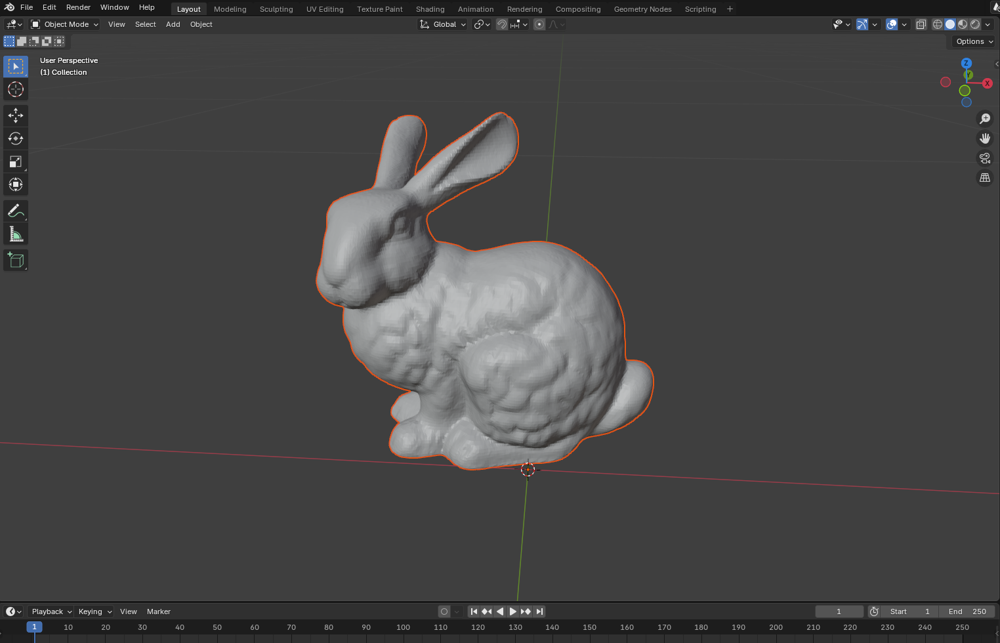
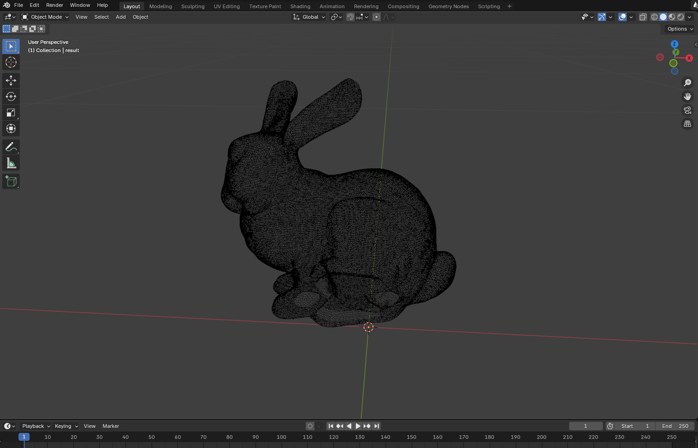

# 3D Mesh Analyzer

This project contains a C program that processes 3D models stored in the OBJ format. The program reads an input OBJ file, computes the centroids of each face, extracts and detects equivalent edges using several methods (including an AVL tree-based approach), and then applies a breadth-first search (BFS) on the dual graph to color the model based on distance from a selected face.

## Features

- **OBJ File Parsing:**  
  Reads vertices and faces from an OBJ file.
  
- **Centroid Calculation:**  
  Computes the centroid of each face by averaging the coordinates of its three vertices.
  
- **Edge Generalization:**  
  Extracts edges from faces while ensuring a consistent ordering (the smaller vertex index comes first).
  
- **Edge Equivalence Detection:**  
  Detects equivalent (shared) edges using:
  - A selection sort-based method.
  - A heap sort-based method.
  - An AVL tree-based method for efficient insertion and detection.
  
- **Dual Graph Construction & BFS Coloring:**  
  Constructs a dual graph where each node represents a face and edges connect adjacent faces. A BFS traversal computes a distance metric used to generate a color gradient.
  
- **Output Generation:**  
  Writes a new OBJ file that includes colored vertices (with RGB values) and lines representing the dual edges.

## Requirements

- C compiler (GCC is recommended)
- Standard C libraries

## Compilation

To compile the program, run:

```bash
gcc -o projet projet.c
```

or

```bash
make
```

## Usage

After compiling, run the executable with the input OBJ file and the desired output file name as arguments:

```bash
./projet input.obj output.obj
```

## Example of Analysis

### Before Processing



### After



Blender has issues when handling colors. :(
